# VetNow

Aplicación móvil multiplataforma (Android e iOS) que conecta propietarios de mascotas con clínicas veterinarias en España. Equivalente conceptual a Doctoralia, orientado al sector veterinario.


---

## Descripción

**VetNow** actúa como plataforma intermediaria entre dos tipos de usuario con necesidades distintas:

| Rol | Descripción |
|-----|-------------|
| **Propietario** (`owner`) | Busca clínicas por ciudad, especialidad o proximidad; gestiona mascotas; reserva y consulta citas sin llamadas. |
| **Clínica** (`clinic`) | Gestiona perfil público, confirma o deniega citas, consulta agenda y expedientes médicos de pacientes. |

El rol se elige en el registro y es **inmutable**: una sola app atiende a ambos perfiles con navegación, permisos y datos separados por diseño.

---

## Capturas de pantalla

Vista general de la aplicación por rol. Las imágenes se almacenan en `docs/screenshots/` (añade ahí tus capturas con los nombres indicados).

### Propietario

| Búsqueda de clínicas | Detalle y mapa | Reserva de cita |
|:---:|:---:|:---:|
| 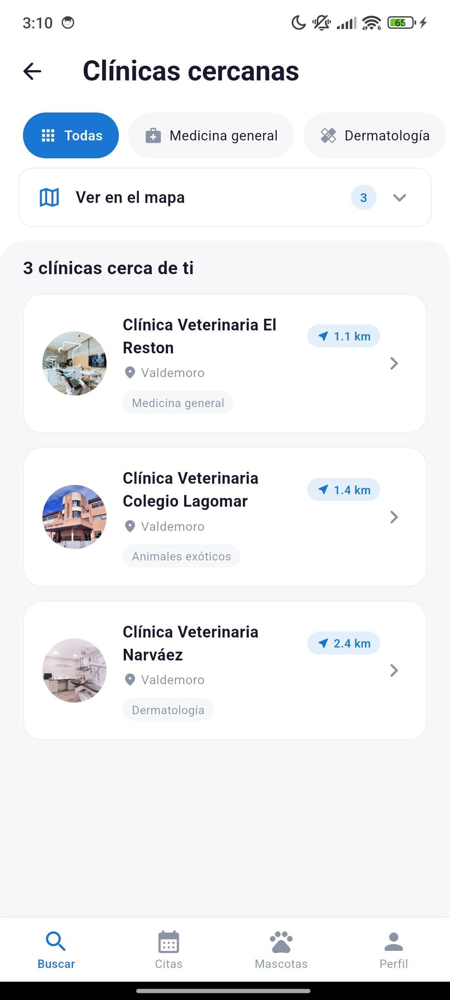 | 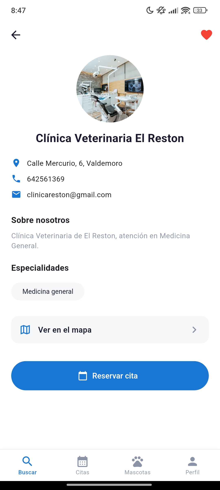 | 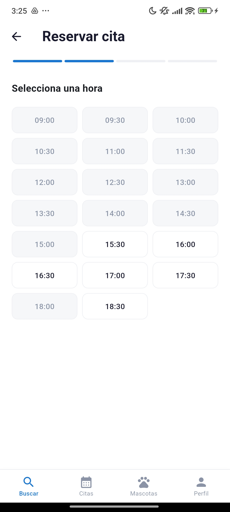 |

| Mis mascotas | Mis citas | Perfil |
|:---:|:---:|:---:|
| 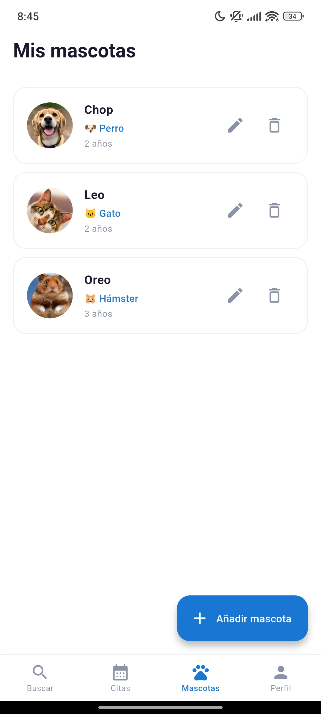 | 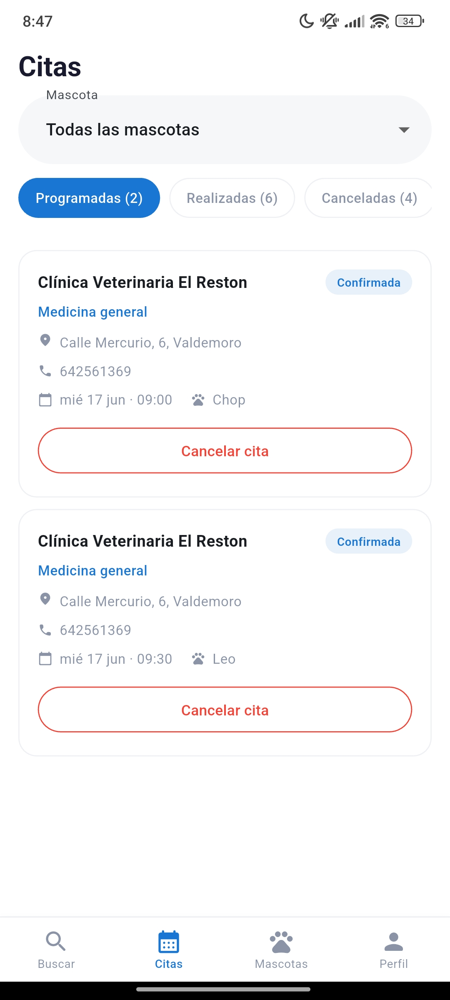 | 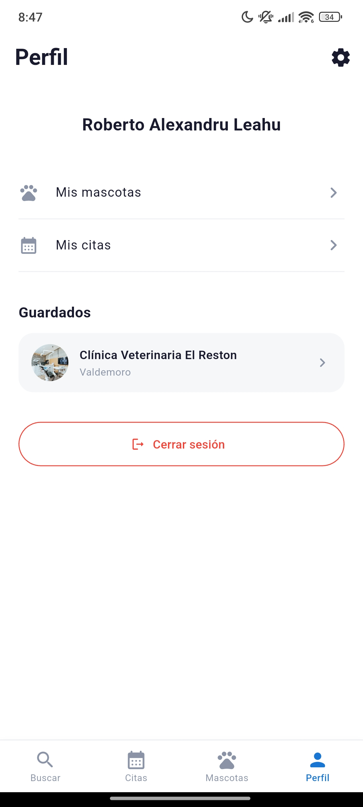 |

### Clínica

| Dashboard | Agenda | Pacientes |
|:---:|:---:|:---:|
| 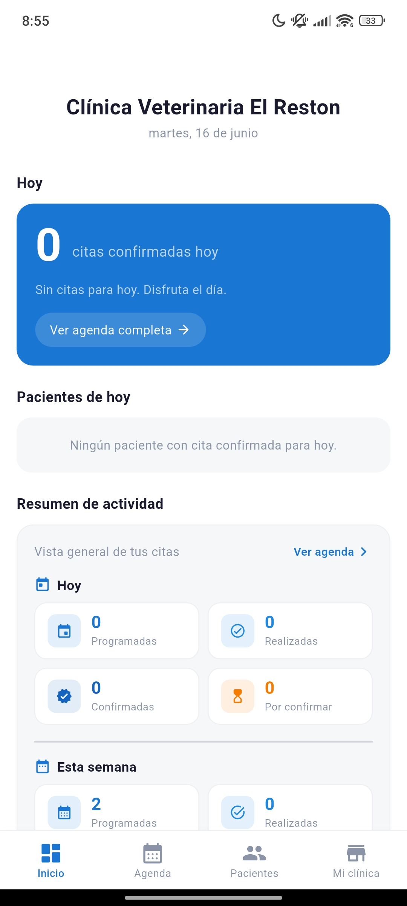 | 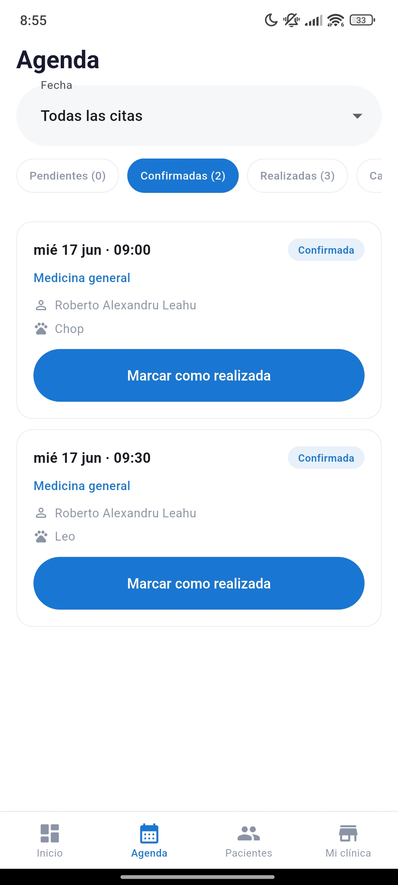 | 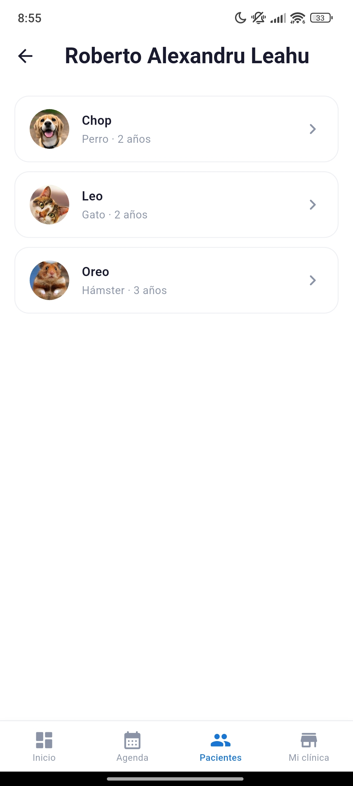 |

| Perfil de clínica | Notas médicas |
|:---:|:---:|
| 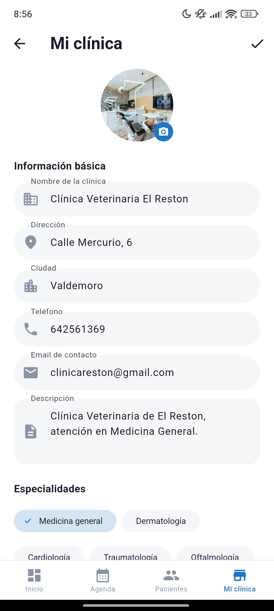 | 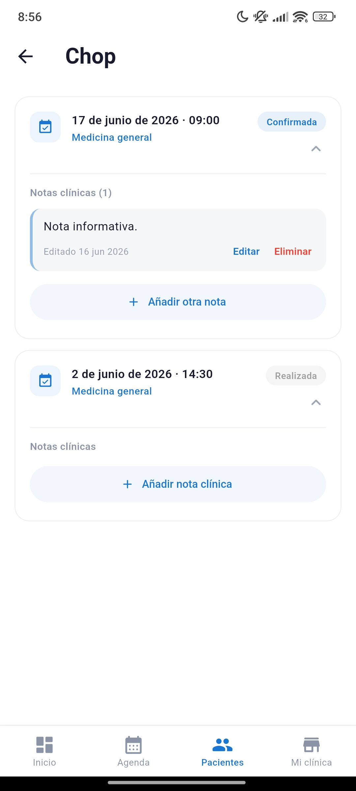 |

---

## Funcionalidades

### Propietario

- Registro e inicio de sesión con aceptación de privacidad y términos legales
- Búsqueda de clínicas por texto (nombre, ciudad, dirección) y por **proximidad** (mapa + lista, radio ~10 km)
- Favoritos y detalle de clínica con mapa (OpenStreetMap)
- Reserva de citas en varios pasos: fecha, hora (slots según horario y duración de la clínica), mascota y confirmación
- Gestión de mascotas con foto (cámara o galería)
- Listado de citas con pestañas (pendientes, confirmadas, historial)
- Recordatorios por email antes de la cita
- Perfil, ajustes de cuenta, modo oscuro e idioma (español / inglés)

### Clínica

- Dashboard con resumen del día y métricas de la semana
- Agenda con confirmación, denegación y marcado de citas realizadas
- Notificación por email al propietario al confirmar o denegar
- Gestión de pacientes y notas médicas por visita
- Edición de perfil de clínica (datos, horarios, especialidades, duración de cita, logo)
- Geocodificación automática de dirección (Nominatim) para aparecer en búsqueda cercana

---

## Stack tecnológico

| Capa | Tecnología |
|------|------------|
| Cliente | Flutter (Dart ^3.11.3) |
| Estado | Riverpod (`flutter_riverpod`, `riverpod_annotation`) |
| Navegación | go_router (ShellRoute + bottom nav por rol) |
| Backend | Supabase (Auth, PostgreSQL + RLS, Storage, Edge Functions) |
| Emails | Resend (Edge Functions) |
| Mapas / GPS | `flutter_map`, `latlong2`, `geolocator` |
| i18n | `flutter gen-l10n` (ARB en `lib/l10n/`) |
| Persistencia local | `shared_preferences` (idioma preferido) |

### Dependencias principales

| Paquete | Versión |
|---------|---------|
| `supabase_flutter` | ^2.5.0 |
| `flutter_riverpod` | ^2.5.1 |
| `go_router` | ^13.2.0 |
| `flutter_map` | ^7.0.2 |
| `geolocator` | ^11.0.0 |
| `flutter_dotenv` | ^5.1.0 |
| `intl` | ^0.20.2 |
| `image_picker` | ^1.0.7 |
| `equatable` | ^2.0.5 |

Documentación técnica ampliada: [ARQUITECTURA.md](ARQUITECTURA.md).

---

## Arquitectura

Arquitectura **cliente + BaaS** en dos capas: la app Flutter habla directamente con Supabase; no hay servidor propio intermedio. La seguridad de datos se delega en **Row-Level Security (RLS)** de PostgreSQL.

En el cliente, cada funcionalidad vive en un módulo bajo `lib/features/` con tres capas:

```
UI (widgets/pantallas)
  → Providers (Riverpod: FutureProvider, StreamProvider, invalidación)
    → Repositories (data/: única capa que importa Supabase)
      → Supabase (PostgreSQL, Auth, Storage, RPC, Edge Functions)
```

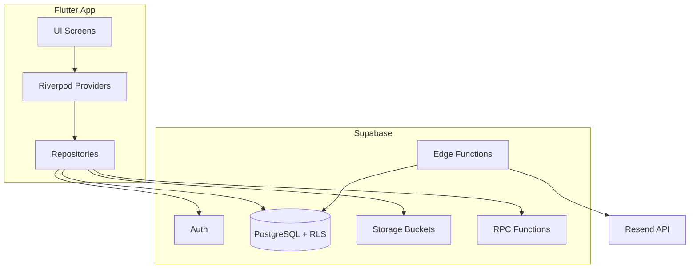

Tras cada mutación, `ref.invalidate(provider)` recarga los datos y la UI se reconstruye de forma reactiva.

---

## Estructura del proyecto

```
lib/
├── main.dart
├── l10n/                    # ARB (es/en) + localizaciones generadas
├── app/                     # MaterialApp, router, MainShell, tema
├── core/                    # Supabase client, errores, locale, GPS, fechas
├── features/
│   ├── auth/
│   ├── clinic/              # Búsqueda y detalle (rol owner)
│   ├── appointment/
│   ├── pet/
│   ├── profile/
│   └── clinic_panel/        # Panel completo (rol clinic)
└── shared/                  # Modelos, widgets, legal

supabase/
├── migrations/              # Esquema, RLS, RPC, buckets
└── functions/
    ├── send-appointment-reminders/
    ├── send-appointment-notification/
    └── delete-account/
```

### Base de datos (resumen)

| Tabla | Propósito |
|-------|-----------|
| `profiles` | Perfil de usuario (rol, nombre, consentimiento legal) |
| `clinics` | Datos públicos de clínica, coordenadas, duración de cita |
| `specialties` / `clinic_specialties` | Catálogo y relación N:M |
| `schedules` | Horario semanal por clínica |
| `pets` | Mascotas del propietario |
| `appointments` | Citas (estado, duración, recordatorio, `completed_at`) |
| `medical_notes` | Notas clínicas por visita |
| `clinic_favorites` | Favoritos del propietario |

**RPC:** `get_booked_slots`, `complete_past_appointments`  
**Storage:** `clinic-logos`, `pet-photos`

---

## Requisitos previos

- [Flutter SDK](https://docs.flutter.dev/get-started/install) compatible con Dart **^3.11.3**
- Android Studio / Xcode según la plataforma objetivo
- [Cuenta Supabase](https://supabase.com/) (proyecto con Auth y PostgreSQL)
- [Cuenta Resend](https://resend.com/) (emails desde Edge Functions)
- [Supabase CLI](https://supabase.com/docs/guides/cli) (recomendado para migraciones y despliegue de funciones)

---

## Configuración del entorno

Crea un archivo `.env` en la raíz del proyecto (no lo subas a git). La app lo carga como asset definido en `pubspec.yaml`:

```env
SUPABASE_URL=https://tu-proyecto.supabase.co
SUPABASE_ANON_KEY=tu_anon_key
```

Variables usadas en [`lib/main.dart`](lib/main.dart) al iniciar Supabase.

---

## Instalación y ejecución

```bash
git clone <url-del-repositorio>
cd vetnow
flutter pub get
flutter run
```

Para un dispositivo o emulador concreto:

```bash
flutter devices
flutter run -d <device_id>
```

Build de release (ejemplo Android):

```bash
flutter build apk --release
```

---

## Supabase — configuración inicial

### 1. Migraciones

Aplica el SQL versionado en `supabase/migrations/` en orden cronológico (Supabase CLI o SQL Editor del dashboard):

```bash
supabase link --project-ref <tu-project-ref>
supabase db push
```

O ejecuta los archivos manualmente en el orden de su prefijo de fecha.

### 2. Edge Functions

Despliega las funciones en `supabase/functions/`:

| Función | Uso |
|---------|-----|
| `send-appointment-reminders` | Cron horario: recordatorio por email antes de la cita |
| `send-appointment-notification` | Email al propietario al confirmar o denegar |
| `delete-account` | Borrado de cuenta con permisos elevados |

```bash
supabase functions deploy send-appointment-reminders
supabase functions deploy send-appointment-notification
supabase functions deploy delete-account
```

### 3. Secrets (Edge Functions)

Configura en el proyecto Supabase (Dashboard → Edge Functions → Secrets o CLI):

| Secret | Descripción |
|--------|-------------|
| `SUPABASE_URL` | URL del proyecto |
| `SUPABASE_ANON_KEY` | Clave anónima (p. ej. `delete-account`) |
| `SUPABASE_SERVICE_ROLE_KEY` | Lectura de emails en `auth.users` y operaciones privilegiadas |
| `RESEND_API_KEY` | API key de Resend |

> En desarrollo, Resend en modo pruebas puede limitar dominios y destinatarios; en producción configura un dominio verificado.

### 4. Storage

Las migraciones crean y configuran los buckets:

- **`clinic-logos`** — logo por clínica (`{clinicId}/logo.{ext}`)
- **`pet-photos`** — foto por mascota (`{ownerId}/{petId}.{ext}`)

Comprueba las políticas RLS asociadas si despliegas en un proyecto nuevo.

### 5. Cron (recordatorios)

La función `send-appointment-reminders` espera un job programado (p. ej. `pg_cron` cada hora). Configúralo en tu instancia Supabase según la documentación del proyecto.

---

## Internacionalización

Idiomas soportados: **español** (plantilla) e **inglés**.

- Archivos fuente: `lib/l10n/app_es.arb`, `lib/l10n/app_en.arb`
- Configuración: [`l10n.yaml`](l10n.yaml)

Tras modificar los ARB, regenera las localizaciones:

```bash
flutter gen-l10n
```

O ejecuta `flutter pub get` / `flutter run` (con `generate: true` en `pubspec.yaml`).

El idioma activo se puede cambiar en **Personalización** sin reiniciar la app (`localeProvider` + `SharedPreferences`).

---

## Desarrollo

### Tests

```bash
flutter test
```

### Análisis estático

```bash
flutter analyze
```

### Generación de código (Riverpod)

Si usas generadores de Riverpod en el futuro:

```bash
dart run build_runner build --delete-conflicting-outputs
```

---

## Licencia

Este proyecto es de uso privado (`publish_to: 'none'` en `pubspec.yaml`).  
Si deseas publicarlo o distribuirlo, define aquí la licencia aplicable (por ejemplo MIT) y actualiza este apartado.

---

## Enlaces útiles

- [Documentación Flutter](https://docs.flutter.dev/)
- [Documentación Supabase](https://supabase.com/docs)
- [ARQUITECTURA.md](ARQUITECTURA.md) — arquitectura, rutas, reglas de negocio y estado del desarrollo
